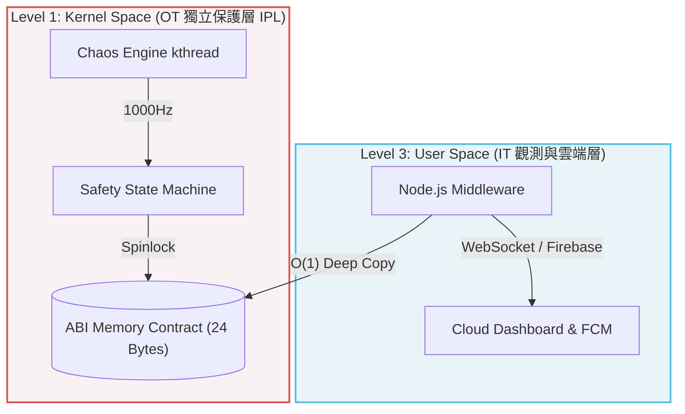
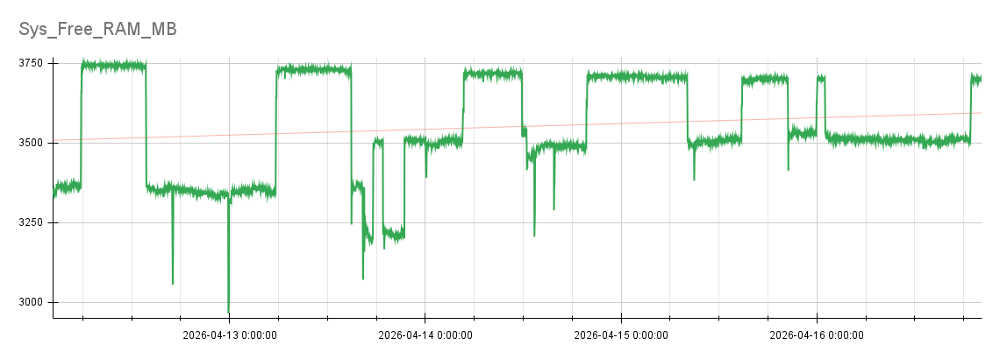
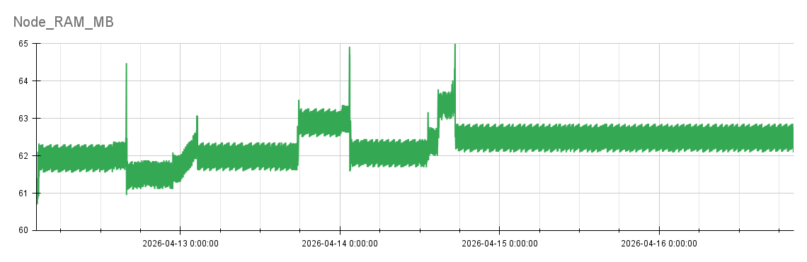

# 🛡️ Edge IPL PoC: Kernel-Level Decoupled Safety Gateway
**在複雜控制系統下，基於 Linux 核心解耦的獨立保護層 (IPL) 概念驗證**


## 📖 Executive Summary (執行摘要)
本專案為針對**複雜控制系統 (Complex Control Systems)** 設計的**獨立保護層 (IPL, Independent Protection Layer)** 概念驗證 (PoC)。

在現代工業物聯網與自駕邊緣設備中，將「硬體防禦邏輯」與「雲端業務邏輯」混雜於單一應用層，極易引發單點故障 (SPOF)。本專案基於工業界 LOPA (保護層分析) 理論，透過 Linux Kernel 核心層的 IT/OT 邊界解耦，實踐了**混合關鍵性隔離 (Mixed-Criticality Isolation)**。

系統底層負責微秒級的實體急停 (E-Stop) 防禦，而上層 Node.js 則降級為無狀態中介層 (Stateless Middleware)。本實作證明了：在通用邊緣設備上，透過精準的作業系統邊界劃分，也能築起不受應用程式崩潰影響的絕對物理防線。

---

## 🏗️ 系統解耦架構 (Architecture Decoupling)

### ❌ 傳統架構的軟即時陷阱 (The Soft Real-Time Trap)
在早期的 V4.0 以前版本，系統採用 Node.js 於 User Space 直接輪詢感測器。當系統遭遇極限網路 I/O 壓力或 V8 引擎垃圾回收 (GC) 時，會產生數百毫秒的不可控延遲。這在工業現場將導致機台無法及時煞車而發生災難。

### ✅ V5.0 革命：IT/OT 故障域隔離 (Fault Domain Isolation)
* **OT 物理防禦層 (Kernel Space IPL)：** 以 C 語言實作 Linux 核心模組。透過 `kthread` 以 1000Hz 頻率運作，專責過濾 EMI 突波並執行實體急停，完全不受 User Space 網路風暴或應用程式崩潰干擾，具備 Firm Real-Time 之確定性。
* **IT 雲端觀測層 (User Space Middleware)：** 透過定義嚴謹的 ABI 記憶體合約，Node.js 降級為純粹的通訊翻譯層，負責讀取底層狀態並向 Firebase/WebSocket 提供零阻塞的 JSON 廣播。


---

## 🚀 Core Technical Highlights (核心技術突破)

### 1. 突破中斷上下文陷阱：$O(1)$ 深拷貝與 Spinlock 防禦
為解決多核心 (SMP) 環境下的快取競爭 (Cache Contention) 與 `copy_to_user` 觸發 Page Fault 導致的 Kernel Panic，本系統實作了以 24 Bytes 為單位的固定長度記憶體合約。
* 採用 spin_lock_irqsave 保護臨界區段，達成中斷安全的併發控制。
* 在 CPU/VM/IO 三方滿載的極限壓測下，吞吐量逆勢突破 338 萬次 IOCTLs/sec，實證零死鎖 (Zero Deadlock)。

### 2. SRE 混沌工程：軟體在環故障注入 (SIL Fault Injection)
為進行嚴苛的架構防禦力驗證，本系統捨棄外部訊號產生器，直接於 Kernel 層實作核心級確定性故障注入引擎，以 1000Hz 頻率精準觸發：`CRUISING` (穩態)、`EMI_SPIKE` (微秒級電磁突波) 與 `EMERGENCY_STOP` (硬體急停)。
透過 Software-in-the-Loop (SIL) 測試機制，在不損耗實體機台的前提下，逼出系統的物理極限。

### 3. 無人值守維運：SOP 優雅降級 (Zero-touch & Graceful Degradation)
深度整合 Systemd 與硬體看門狗 (Watchdog)。前端戰情室導入連線心跳偵測，當 IT 網路斷線時，UI 自動切換為「SOP 牧羊犬模式」防堵誤操作；底層 Kernel 則持續維持物理防護，達成完美的「失效安全 (Fail-Safe)」。

---

## 📊 Reliability & Telemetry (穩定度與遙測驗證)

本架構已於 Raspberry Pi 5 平台上通過嚴苛的 **96 小時連續燒機測試 (96-hour+ Burn-in Test)**：

<div align="center">
  
  
</div>

> *▲ 封關遙測圖表 (含線性趨勢線)：左圖證實系統記憶體維持健康的 Page Cache 動態調度；右圖證實 Node.js V8 引擎在底層 I/O 承壓下仍能強制執行 Major GC，達成完美動態平衡。*

* **絕對物理防禦：** 注入超過 3 億次極端故障，歷經 96 小時維持 0 系統死鎖 (Zero Deadlock)。
* **零記憶體洩漏 (0% Memory Leak)：** 右圖證實 Node.js V8 引擎在底層 I/O 極限承壓下仍能強制執行 Major GC，系統記憶體基準線漂移量小於 1MB，達成完美的動態平衡。

---

## 🔮 未來架構藍圖 (Future Roadmap: V6.0)
基於 V5.0 穩固的 IPL 基礎，本專案已確立 **V6.0 的三層式混合關鍵性架構** 重構藍圖：
計畫於 User Space 引入 **ROS 2 (Robot Operating System 2)** 作為 L2 中介層。透過 DDS (Data Distribution Service) 發布/訂閱模型，在不干擾 L1 Kernel IPL 物理防禦的前提下，重新整合高複雜度的感測器網路 (Sensor Fusion)，完成從單一安全閘道器至複雜自駕控制系統的典範轉移。

---
## 📁 Repository Structure (專案結構)

採用基礎設施堆疊 (Infrastructure Stack) 的 Monorepo 結構：

```text
hard-realtime-edge-stack/
├── core/                  # [OT] Linux Kernel Module (物理防禦引擎、Spinlock、ABI)
├── middleware/            # [IT] Node.js Adapter (無狀態 JSON 轉換與 WebSocket 廣播)
├── apps/
│   └── dashboard/         # [HMI] 戰情室前端 (具備 Visual Latching 與稽核日誌)
├── tests/                 # [QA] elc_diag.c (風洞極限壓測)、monitor.sh (SRE 健康遙測)
└── docs/
    └── ADRs/              # [架構文檔] ADR-001 ~ ADR-007 架構決策演進史
```
**💡研讀建議：** 本專案 docs/ADRs/ 完整收錄了從早期 V1.0 應用層架構，經歷資料庫 I/O 崩潰，最終重構至 V5.0 核心解耦的「正、反、合」架構思維演進史。建議從 ADR-005 開始閱讀，以理解底層記憶體機制的設計初衷。
